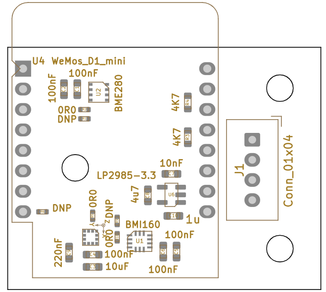
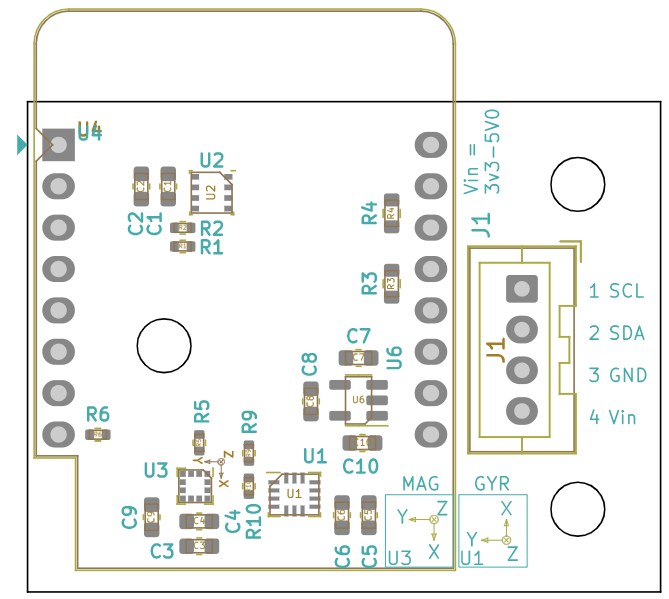

# SENSOR_10DOF

- ACC/Gyro	(BMI160/323)
- ACC/Mag	(LSM303AGR)
- T/P/RH	(BME280)

# Hardware

<p float="left">
  
</p>


| Top side                |Bottom side               |
|-----------------------:|:-------------------------:|
|  |  |

<p float="left">
  
</p>

| Values                 | Reference                 |
|-----------------------:|:-------------------------:|
|  |  |


# Software

**BMI160:**
```diff
+ 0x68 --> SDO to GND (default)
# 0x69 --> SDO to VDDIO
```

**BMI323:**
```diff
+ 0x68 --> SDO to GND (default)
# 0x69 --> SDO to VDDIO
```

**BME280:**
```diff
+ 0x76 --> SDO to GND (default)
# 0x77 --> SDO to VDDIO
```


**LSM303AGR:**
```diff
+ 0x3A --> ACC (default)
+ 0x3C --> MAG (default)
```

## Driver

### lsm303agr

Standard C platform-independent drivers for MEMS motion and environmental sensors
- https://www.st.com/en/embedded-software/c-driver-mems.html
- https://github.com/STMicroelectronics/x-cube-mems1

Arduino/Grove
- https://github.com/Seeed-Studio/Grove_6Axis_Accelerometer_And_Compass/blob/master/examples/CompensatedCompass.ino

embedded/lsm303agr

``` c
/* USER CODE BEGIN PV */
static struct lsm303agr_dev Sensor;

/* USER CODE BEGIN 0 */
int8_t i2c_1_read(uint8_t dev_addr, uint8_t reg_addr, uint8_t *data, uint16_t len)
{
	int8_t result;

	result = HAL_I2C_Master_Transmit(&hi2c1, (uint16_t) dev_addr, &reg_addr, 1, 10);
	result += HAL_I2C_Master_Receive(&hi2c1, (uint16_t) dev_addr, data, len, 10);
	return result;
}

int8_t i2c_1_write(uint8_t dev_addr, uint8_t reg_addr, uint8_t *data, uint16_t len)
{
	int8_t result;
	uint8_t buffer[128];

	buffer[0] = reg_addr;
	memcpy(&buffer[1], data, len);

	result = HAL_I2C_Master_Transmit(&hi2c1, (uint16_t) dev_addr, buffer, len + 1, 100);
	return result;
}


void main(void)
{
	/* Hardware init*/
	
	........
	/*  */
	Sensor.dev_addr_mag = LSM303AGR_MAG_I2C_ADDRESS;
	Sensor.dev_addr_acc = LSM303AGR_ACC_I2C_ADDRESS;
	Sensor.read = i2c_1_read;
	Sensor.write = i2c_1_write;

	struct lsm303agr_mag_data magData;
	struct lsm303agr_acc_data accData;

	int8_t res = lsm303agr_mag_init(LSM303AGR_CONTINUOUS, &Sensor);
	res = lsm303agr_acc_init(LSM303AGR_ACC_NORMAL_MODE, &Sensor);

	...

	while (1)
	{
		int8_t rslt = 0;

		rslt = lsm303agr_mag_read_data(&magData, &Sensor);
		
		uint8_t data_ready_status = 0;
		lsm303agr_acc_get_DataReadyStatus(&data_ready_status, &Sensor);
		
		if (data_ready_status != 0)
		{
			lsm303agr_acc_read_data(&accData, &Sensor);
			rslt += lsm303agr_temp_read_data(&temperature, &Sensor);
		}
	}
}


```

### BMI160/323:

- https://github.com/boschsensortec/BMI160_driver
- https://github.com/boschsensortec/BMI323-Sensor-API

## Calibration of Magnetometer with Acc-Sensor

Application note: AN3192 Using LSM303DLH for a tilt compensated electronic compass

Masterarbeit
- https://reposit.haw-hamburg.de/bitstream/20.500.12738/8460/1/Masterarbeit_Tobias_Michaelsen.pdf

Lib von ST
- https://github.com/STMicroelectronics/x-cube-mems1

Eine Sammlung von Links zu dem Thema
- https://github.com/Seeed-Studio/Grove_6Axis_Accelerometer_And_Compass/blob/master/examples/CompensatedCompass.ino

- https://www.nxp.com/docs/en/application-note/AN4248.pdf
- https://www.nxp.com/docs/en/application-note/AN4249.pdf
- https://www.st.com/resource/en/design_tip/dt0058-computing-tilt-measurement-and-tiltcompensated-ecompass-stmicroelectronics.pdf
- https://www.bosch-sensortec.com/media/boschsensortec/downloads/datasheets/bst-bmm150-ds001.pdf

## Kalmanfilter
- https://www.cbcity.de/das-kalman-filter-einfach-erklaert-teil-1
- https://www.cbcity.de/das-kalman-filter-einfach-erklaert-teil-2
- https://www.cbcity.de/4d-kalman-filter-in-c
  
- https://www.halvorsen.blog/documents/automation/kalman_filter/LabVIEW%20Kalman%20Filter%20Examples.pdf

## Rotationsmatrix
- https://www.cbcity.de/tutorial-rotationsmatrix-und-quaternion-einfach-erklaert-in-din70000-zyx-konvention

