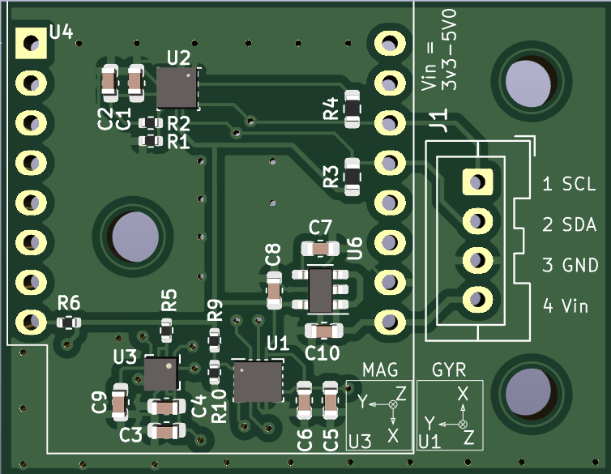

# SENSOR_10DOF

- ACC/Gyro	(BMI160/323)
- ACC/Mag	(LSM303AGR)
- T/P/RH	(BME280)

# Hardware

<p float="left">
  
</p>


| Top side                |Bottom side               |
|-----------------------:|:-------------------------:|
|  |  |

<p float="left">
  
</p>

# Software

**BMI160:**
```diff
+ 0x68 --> SDO to GND (default)
# 0x69 --> SDO to VDDIO
```

**BMI323:**
```diff
+ 0x68 --> SDO to GND (default)
# 0x69 --> SDO to VDDIO
```

**BME280:**
```diff
+ 0x76 --> SDO to GND (default)
# 0x77 --> SDO to VDDIO
```


**LSM303AGR:**
```diff
+ 0x3A --> ACC (default)
+ 0x3C --> MAG (default)
```

## Driver

### lsm303agr

Standard C platform-independent drivers for MEMS motion and environmental sensors
- https://www.st.com/en/embedded-software/c-driver-mems.html
- https://github.com/STMicroelectronics/x-cube-mems1

Arduino/Grove
- https://github.com/Seeed-Studio/Grove_6Axis_Accelerometer_And_Compass/blob/master/examples/CompensatedCompass.ino


### BMI160/323:

- https://github.com/boschsensortec/BMI160_driver
- https://github.com/boschsensortec/BMI323-Sensor-API

## Calibration of Magnetometer with Acc-Sensor

Application note: AN3192 Using LSM303DLH for a tilt compensated electronic compass

Masterarbeit
- https://reposit.haw-hamburg.de/bitstream/20.500.12738/8460/1/Masterarbeit_Tobias_Michaelsen.pdf

Lib von ST
- https://github.com/STMicroelectronics/x-cube-mems1

Eine Sammlung von Links zu dem Thema
- https://github.com/Seeed-Studio/Grove_6Axis_Accelerometer_And_Compass/blob/master/examples/CompensatedCompass.ino

- https://www.nxp.com/docs/en/application-note/AN4248.pdf
- https://www.nxp.com/docs/en/application-note/AN4249.pdf
- https://www.st.com/resource/en/design_tip/dt0058-computing-tilt-measurement-and-tiltcompensated-ecompass-stmicroelectronics.pdf
- https://www.bosch-sensortec.com/media/boschsensortec/downloads/datasheets/bst-bmm150-ds001.pdf


